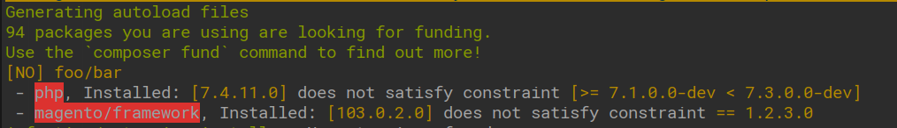

## app/code constraint checker

This is a composer plugin for Magento 2 that validates the constraint from propriatary app/code modules' composer.json file against the installed packages.

As of time of creating this plugin, Magento recommends adding a composer.json file when creating a component:

> We recommend you include composer.json in your component’s root directory even if you do not intend to distribute it to other merchants using Magento.

This however, does not matter if your modules lives in app/code. You may declare all the constraints you want, but you'll probably forget about these as the project grows.

The goal of this plugin is to make the app/code/Vendor/Module/composer.json meaningful for developers.

## Features

After running `composer install`, a list of modules with dependency violations will show up

The plugin will scan and verify the app/code packages and their dependencies and warn if a package version does not satisfy.

Since this plugin treats app/code modules as composer packages in memory, It can do cross checks between those modules as well.
This means the plugin will not only check platform and "vendor" packages. But can also scan other app/code modules as if they were real packagesg.

## Installation

`composer require prooxxy/magento2-composer-constraints` 

## FAQ

### My module is not showing up in the list

The plugin should only should modules that have dependency violations.

It could also be that your module does not have the "version" tag in it's composer.json file. This is a requirement by the composer parser.

### Will this plugin prevent installations or in any other way hinder if any violations are detected?

No

### How can I know if the plugin detected my module?

Run composer with the -v flag and even modules without violations should render 

### I found a bug!

Great! submit a bug report!

## Roadmap

1. plugin should detect and respect "--ignore-platform-reqs"
2. plugin should check require-dev links

## Compatibility Matrix

|       | Magento 2.2 | Magento 2.3 | Magento 2.4 |
|-------|-------------|-------------|-------------|
| `1.x` |      ×      |      ✓      |      ×      |
| `2.x` |      ×      |      ×      |      ✓      |

## License

[MIT](https://choosealicense.com/licenses/mit/)
